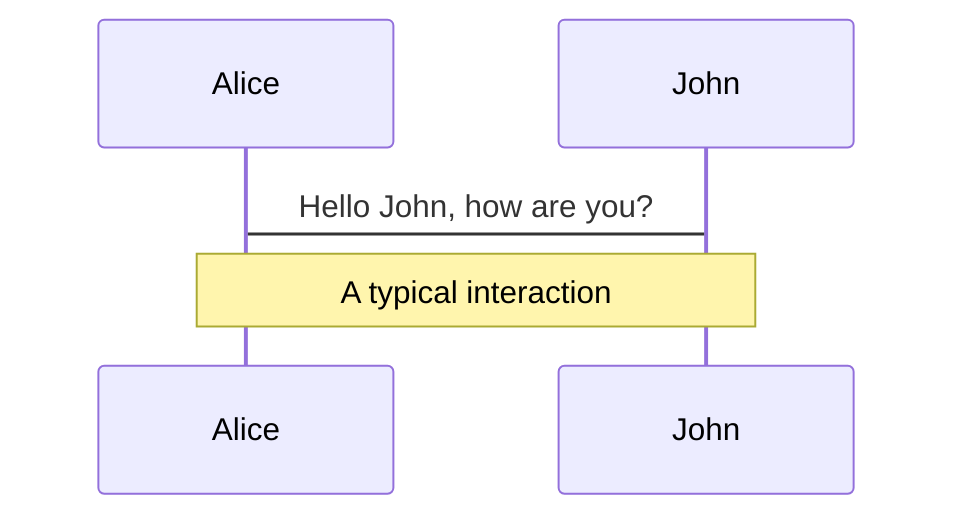
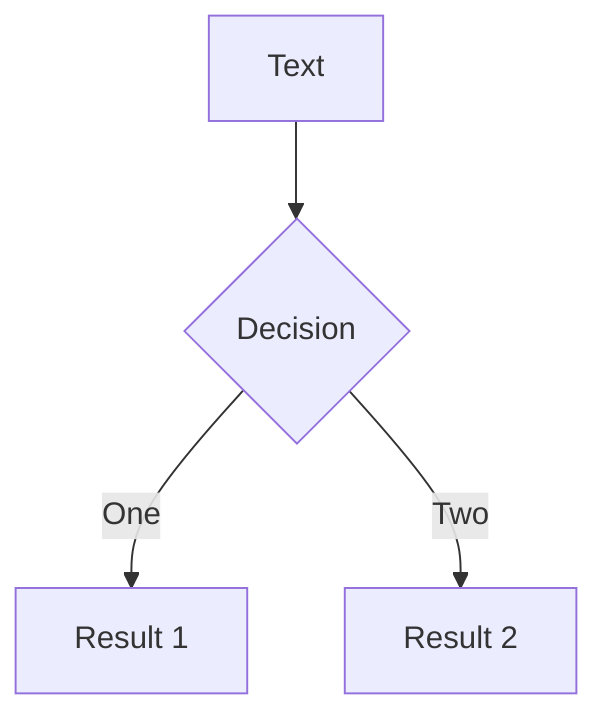

---
# try also 'default' to start simple
theme: default
# random image from a curated Unsplash collection by Anthony
# like them? see https://unsplash.com/collections/94734566/slidev
background: https://source.unsplash.com/collection/94734566/1920x1080
# apply any windi css classes to the current slide
class: 'text-center'
# https://sli.dev/custom/highlighters.html
highlighter: monaco
# show line numbers in code blocks
lineNumbers: false
# some information about the slides, markdown enabled
info: |
  ## Slidev Starter Template
  Presentation slides for developers.

  Learn more at [Sli.dev](https://sli.dev)
# persist drawings in exports and build
drawings:
  persist: false
---

# State Management

A look into state management in react apps

<div class="pt-12">
  <span @click="$slidev.nav.next" class="px-2 py-1 rounded cursor-pointer" hover="bg-white bg-opacity-10">
    Lets get started! <carbon:arrow-right class="inline"/>
  </span>
</div>

<div class="abs-br m-6 flex gap-2">
  <button @click="$slidev.nav.openInEditor()" title="Open in Editor" class="text-xl icon-btn opacity-50 !border-none !hover:text-white">
    <carbon:edit />
  </button>
  <a href="https://github.com/slidevjs/slidev" target="_blank" alt="GitHub"
    class="text-xl icon-btn opacity-50 !border-none !hover:text-white">
    <carbon-logo-github />
  </a>
</div>

---

<h1><span>Quick Refresher on State</span>🥤</h1> 

<p  v-click>In simple terms, State is a JavaScript object that represents the current situation of a component, a specific feature or an entire application and is usually changed based on user interaction with the app.</p>
<p v-click>State Managment starts at component level, our components react to their own state changes, but using component state alone can be painful 🤕 as we might need to know about those changes in other components.</p>
<p v-click>At some degree is posible to manage state between components by lifting it up (will explain later). When dependent components are many through the app, lifting is no longer a good choice.</p>
<h2 v-click class="text-center">Enter Global State 🌎</h2>
<p v-click>It is at this point that we usually move state up, outside of components into a global / application state.</p>
<p v-click>✔️ Global can still be organized by features.</p>
<p v-click>✔️ Components have a single source of thruth, no need to sync.</p>
<p v-click>✔️ Every component can have easy access to it.</p>


<!--
Changes in the application happen usually at component level.

Lifting does not mean going to global although in theory is posible.

Before global state, some other solutions may exist but they rely more on component composition than state management

-->

---
layout: image-right
image: https://source.unsplash.com/collection/94734566/1920x1080
---

<h1><span>So, global it is then</span>😎</h1>

<p  v-click>Not quite...</p>
<br>

<h3 v-click>State Collocation</h3>
<ul>
  <li v-click>Lifting State when maintainable</li>
  <li v-click>Context & hooks for feature state</li>
  <li v-click>Global State for rendering control</li>
</ul>
<br>
<h3 v-click>UI State vs Server Data State</h3>
<ul>
  <li v-click>Merging State</li>
  <li v-click>Spliting State</li>
  <li v-click>Tools for each case</li>
</ul>

<span  v-click class="text-gray-500">This is still redux vs context ⚔️</span>
<span  v-click class="text-gray-500">...and a bit of TypeScript 🙀</span>

<!--
Points we will be touching
 -->
---

<h1><span>State Collocation</span></h1>
<p  v-click>State management starts at component level.</p>
<p  v-click>React can manage state on its own... up close at least.</p>

<h3 v-click>Lifting State Up</h3>

<p  v-click>When several components need to reflect the same changing state, its recommend lifting the shared state up to their closest common parent.</p>

<v-click>
<p>Lets take a simple component for start:</p>

```tsx {all|2|3|5|all}
const Counter: FC = () => {
  const [count, setCount] = useState(0);
  const increment = () => setCount((count) => count + 1);

  return <button onClick={increment}>{count}</button>;
};
```
</v-click>

<p v-after>Counter component handles its own state for incrementing count.</p>

<!-- 
Think of this step as just a first line of deffence agaisnt sate managment problems.
-->
---

<h1><span>State Collocation</span></h1>
<p>State management starts at component level.</p>

<p>What happens if we need that count state somewhere else.</p>
<v-click>
<p>Like in the a CounterDisplay:</p>

```tsx {all|5|6|all}
const CounterPage: FC = () => {
  // Where is the count?
  return (
    <Container maxWidth="xl">
      <Counter /> {/* i have the count */}
      <CounterDisplay /> {/* i need count as well*/}
    </Container>
  );
};
```
</v-click>

<p v-after>CounterDisplay needs the count which is cointained in the counter... no luck there 😢.</p>

<!-- 
Does this mean we need to go global? NO!
-->
---

<h1><span>State Collocation</span></h1>
<p>State management starts at component level.</p>

<p>Seems like a perfect scenario for global state but...</p>

<ul>
  <li v-click>Will the navigation need count state... probably not.</li>
  <li v-click>Will a user menu need count state... not likely</li>
  <li v-click>Will the CounterDisplay need it... yes</li>
</ul>

<p v-click>That makes a good scenario for lifting up state.</p>

---

<h1><span>State Collocation</span></h1>
<p>State management starts at component level.</p>

```tsx {all|3|4|8|9|16|21|all}
// Common parent CounterPage
const CounterPage: FC = () => {
  const [count, setCount] = useState(0);
  const increment = () => setCount((count) => count + 1);

  return (
    <Container maxWidth="xl">
      <Counter count={count} increment={increment} />
      <CounterDisplay count={count} />
    </Container>
  );
};

// Counter
const Counter: FC<CounterType> = ({ count, increment }) => {
  return <button onClick={increment}>{count}</button>;
};

// CounterDisplay
const CounterDisplay: FC<CounterDisplayType> = ({ count }) => {
  return <p>Current count is {count}</p>;
};
```

<!-- 
A bit of light typescript to type component props as well.
-->
---

<h1><span>State Collocation</span></h1>
<p>State management starts at component level.</p>

<p>Lifting state up is not a bad solution for very specific components coupled together. However there is a fine line to cross whenever components outside of certain feature do need that state as well</p>

<p v-click>This is like just the first line of defense against State Managment problems, its worth considering when deppendent components are "close" to each other, therefore, prop drilling can be solved by composition.</p>

<v-click>
<p>Consider an example where CountDisplay needs to pass count to its own children:</p>

```tsx {all|1|5|all}
const CounterDisplay: FC<CounterDisplayType> = ({ count }) => {
  return (
    <>
      <p>Current count is {count}</p>
      <CounterBanner count={count} /> {/* drilling second lvl */}
    </>
  );
};
```
</v-click>

---

<h1><span>State Collocation</span></h1>
<p>State management starts at component level.</p>

<p>Our CounterBanner component will get that count from its parent:</p>

```tsx {all|1|2|4|5|all}
const CounterBanner: FC<CounterBannerType> = ({ count }) => {
  const bannerColor = count >= 10 ? 'lightgreen' : 'pink';
  const countMessage =
    count >= 10
      ? `Congrats! you reached ${count} in the count`
      : `Keep it up, you're still under 10`;

  return (
    <div style={{ background: bannerColor, padding: '4px 18px' }}>
      <h3>{countMessage}</h3>
    </div>
  );
};
```

---

<h1><span>State Collocation</span></h1>
<p>State management starts at component level.</p>

<p>We can eliminate the drilling by refactoring a bit to allow children components:</p>

```tsx {all|2|6|all}
// CounterDisplay
const CounterDisplay: FC<CounterDisplayType> = ({ count, children }) => {
  return (
    <>
      <p>Current count is {count}</p>
      {children}
    </>
  );
};
```

---

<h1><span>State Collocation</span></h1>
<p>State management starts at component level.</p>

<p>And then compose that original component by passing CounterBanner as child component:</p>

```tsx{all|10|all}
// CounterPage (Parent)
const CounterPage: FC = () => {
  const [count, setCount] = useState(0);
  const increment = () => setCount((count) => count + 1);

  return (
    <Container maxWidth="xl">
      <Counter count={count} increment={increment} />
      <CounterDisplay count={count}>
        <CounterBanner count={count} />
      </CounterDisplay>
    </Container>
  );
};
```
<p v-click>This requires no changes for CounterBanner and count prop is not being drilled more than 1 level down. Still, with components tightly coupled like these, prop drilling a couple of levels is not that bad.</p>

---

# Diagrams

You can create diagrams / graphs from textual descriptions, directly in your Markdown.

<div class="grid grid-cols-2 gap-10 pt-4 -mb-6">





</div>

[Learn More](https://sli.dev/guide/syntax.html#diagrams)


---
layout: center
class: text-center
---

# Learn More

[Documentations](https://sli.dev) · [GitHub](https://github.com/slidevjs/slidev) · [Showcases](https://sli.dev/showcases.html)
